# 武汉城市租房市场数据统计与分析系统

> 🌟 作者：小花
> 
> 📍 数据来源：房天下
> 
> 🏘️ 数据范围：武汉
> 
> 📚 项目用途：毕业设计
> 
> 🔗 项目地址：https://github.com/liyankanglyk/Chart_Renter.git

## ✨ 项目介绍

基于Python的城市租房市场数据统计与分析系统是一个集数据采集、数据分析和可视化于一体的完整解决方案。该系统使用爬虫技术采集房源数据，通过数据分析揭示租房市场趋势，并提供直观的数据可视化界面。

## 🚀 技术栈

### 🛠️ 后端技术
- 🐍 Python 3.8+（推荐3.10.16）
- 🌐 Flask (Web框架)
- 💾 MySQL (数据库)
- 🕷️ Scrapy (爬虫框架)
- 📊 Pandas (数据处理)
- 🔢 NumPy (数据分析)
- 🤖 Scikit-learn (机器学习)

### 🎨 前端技术
- ⚡ Vue.js 3
- 🎯 Element Plus (UI组件库)
- 📈 ECharts (数据可视化)
- 🔄 Axios (HTTP客户端)

### 🗄️ 数据库
- 📦 MySQL 8.0+

### 🔧 开发工具
- 💻 Visual Studio Code
- 📝 Git (版本控制)
- 🔍 Postman (API测试)

## 📦 安装步骤

1. 克隆项目
```bash
git clone git@github.com:liyankanglyk/Chart_Renter.git  
cd Chart_Renter
```

2. 创建conda环境
```bash
# 创建名为chart_renter的环境
conda create -n chart_renter python=3.10
# 激活环境
conda activate chart_renter
```

3. 安装Python依赖
```bash
pip install -r requirements.txt
```

4. 安装前端依赖
```bash
cd frontend
npm install
```

5. 配置数据库
```sql
# 1. 首先创建数据库
CREATE DATABASE IF NOT EXISTS chart_renter DEFAULT CHARACTER SET utf8mb4 COLLATE utf8mb4_unicode_ci;
# 2. 修改config.py中的数据库配置
MYSQL_HOST = 'localhost'
MYSQL_USER = '你的用户名'
MYSQL_PASSWORD = '你的密码'  
MYSQL_DB = 'chart_renter'
MYSQL_PORT = 3306  # 根据实际情况修改
```

⚠️ 注意：请确保MySQL服务已启动，并且配置的用户名和密码正确。

6. 数据库表创建
```sql
# 在MySQL中执行以下SQL语句创建必要的表

-- 用户表
CREATE TABLE `users` (
  `id` INT AUTO_INCREMENT PRIMARY KEY,
  `username` VARCHAR(50) NOT NULL UNIQUE COMMENT '用户名',
  `password_hash` VARCHAR(255) NOT NULL COMMENT '密码哈希',
  `email` VARCHAR(100) UNIQUE COMMENT '邮箱',
  `role` ENUM('admin', 'user') DEFAULT 'user' COMMENT '用户角色',
  `created_at` TIMESTAMP DEFAULT CURRENT_TIMESTAMP COMMENT '创建时间',
  `last_login` TIMESTAMP NULL COMMENT '最后登录时间',
  `is_active` BOOLEAN DEFAULT TRUE COMMENT '是否激活'
) ENGINE=InnoDB DEFAULT CHARSET=utf8mb4 COMMENT='用户信息表';

-- 初始化管理员账户
-- 默认账号：admin
-- 默认密码：123456
INSERT INTO `users` VALUES (3, 'admin', 'scrypt:32768:8:1$m0Ee5iYm0XM1QPu7$4e5c30d33e707e848d8dd2939c6df5e3f406d70f7e8f2c4bc30a600a499f32a5f153d4ecad30398f6d007c44c24906c0345eb5e8f4489a1bda5d2bb197ded3f4', 'admin@gail.com', 'user', '2025-03-03 14:45:38', '2025-03-04 02:16:25', 1);

-- 房源信息表
CREATE TABLE `rental_houses` (
  `id` INT AUTO_INCREMENT PRIMARY KEY,
  `title` VARCHAR(200) NOT NULL COMMENT '房源标题',
  `district` VARCHAR(50) COMMENT '所在区域',
  `community` VARCHAR(100) COMMENT '小区名称',
  `address` VARCHAR(255) COMMENT '详细地址',
  `price` DECIMAL(10,2) NOT NULL COMMENT '月租金(元)',
  `house_type` VARCHAR(50) COMMENT '户型(如: 2室1厅1卫)',
  `area` DECIMAL(8,2) COMMENT '面积(平方米)',
  `direction` VARCHAR(50) COMMENT '朝向',
  `floor` VARCHAR(50) COMMENT '楼层信息',
  `decoration` VARCHAR(50) COMMENT '装修情况',
  `rental_type` VARCHAR(50) COMMENT '租赁方式(整租/合租)',
  `facilities` TEXT COMMENT '配套设施',
  `description` TEXT COMMENT '描述信息',
  `contact_info` VARCHAR(100) COMMENT '联系方式',
  `publish_time` DATETIME COMMENT '发布时间',
  `crawl_time` TIMESTAMP DEFAULT CURRENT_TIMESTAMP COMMENT '爬取时间',
  `data_source` VARCHAR(50) COMMENT '数据来源网站',
  `source_url` VARCHAR(255) COMMENT '原始链接'
) ENGINE=InnoDB DEFAULT CHARSET=utf8mb4 COMMENT='房源信息表';

```

## 🚀 运行项目

1. 启动后端服务
```bash
# 在项目根目录下
python run.py
```

2. 启动前端开发服务器
```bash
# 在frontend目录下
npm run serve
```

3. 访问系统
- 🌐 前端页面：http://localhost:8080
- 🛠️ 后端API：http://localhost:5000

## 🎯 主要功能

1. 📥 数据采集
   - 🤖 自动爬取房源网站数据
2. 📊 数据分析
   - 💰 租金价格分析
   - 🗺️ 区域分布分析
   - 🏘️ 房源特征分析
   - 📈 市场趋势分析
3. 📺 可视化展示
   - 🌡️ 价格热力图
   - 🗺️ 区域分布图
   - 📈 趋势折线图
   - 📊 特征对比图
4. 👤 用户功能
   - 🔐 用户注册登录


## 📂 项目结构

```
Chart_Renter/
├── 🕷️ crawler/                     # 爬虫模块
│   ├── spiders/                    # 爬虫实现
│   │   └── wuhan_housing.py        # 武汉租房爬虫主文件
│   ├── items.py                    # 数据项定义
│   ├── pipelines.py               # 数据处理管道
│   └── settings.py                # 爬虫设置
│
├── 📊 data/                        # 数据目录
│   ├── raw/                       # 原始数据
│   │   └── wuhan_housing.csv      # 原始爬取数据
│   ├── processed/                 # 预处理后的数据
│   │   └── wuhan_cleaned.csv      # 清洗后的数据
│   ├── temp/                      # 临时JSON文件
│   ├── districts/                 # 各区域CSV文件
│   │   ├── hongshan.csv          # 洪山区数据
│   │   ├── wuchang.csv           # 武昌区数据
│   │   └── ...                   # 其他区域数据
│   └── logs/                      # 日志文件
│   ├── run预处理.py             # 数据预处理脚本
│   ├── statistical_analysis.py    # 统计分析脚本
│   └── price_prediction.py        # 租金预测模型
│
├── 🖥️ backend/                     # Flask后端
│   ├── __init__.py               # 包初始化
│   ├── app.py                    # 应用主入口
│   ├── routes/                   # API路由
│   │   ├── __init__.py
│   │   ├── auth.py              # 认证相关路由
│   │   ├── houses.py            # 房源相关路由
│   │   └── analysis.py          # 数据分析路由
│   ├── models/                   # 数据模型
│   │   ├── __init__.py
│   │   ├── user.py              # 用户模型
│   │   └── house.py             # 房源模型
│   ├── services/                 # 业务逻辑
│   │   ├── __init__.py
│   │   ├── crawler_service.py    # 爬虫服务
│   │   ├── analysis_service.py   # 分析服务
│   │   └── user_service.py       # 用户服务
│   └── utils/                    # 工具函数
│       ├── __init__.py
│       └── helpers.py            # 辅助函数
│
├── 🎨 frontend/                    # Vue前端
│   ├── public/                   # 静态资源
│   ├── src/                      # 源代码
│   │   ├── assets/              # 资源文件
│   │   ├── components/          # 组件
│   │   │   ├── charts/         # 图表组件
│   │   │   ├── common/         # 通用组件
│   │   │   └── layout/         # 布局组件
│   │   ├── views/              # 页面视图
│   │   ├── router/             # 路由配置
│   │   ├── store/              # 状态管理
│   │   ├── api/                # API接口
│   │   └── utils/              # 工具函数
│   ├── package.json             # 依赖配置
│   └── vue.config.js            # Vue配置
│
├── 📝 docs/                        # 文档
│   ├── api.md                    # API文档
│   ├── database.md               # 数据库设计
│   ├── deployment.md             # 部署说明
│   └── development.md            # 开发指南
│
├── 🔧 tests/                       # 测试目录
│   ├── test_crawler/             # 爬虫测试
│   ├── test_analysis/            # 分析模块测试
│   └── test_api/                 # API测试
│
├── ⚙️ config.py                    # 全局配置文件
├── 📄 requirements.txt             # Python依赖
├── 📋 README.md                    # 项目说明
└── 🚀 run.py                       # 项目启动脚本
```

### 📁 目录说明

#### 1. 爬虫模块 (crawler/)
- 实现武汉房源数据的自动化采集
- 包含爬虫核心逻辑和数据处理管道
- 支持定时任务和增量更新

#### 2. 数据目录 (data/)
- 存储原始和处理后的房源数据
- 按区域分类存储CSV文件
- 包含日志和临时文件

#### 3. 数据分析模块 (analysis/)
- 数据预处理和清洗功能
- 统计分析和可视化实现
- 租金预测模型

#### 4. 后端模块 (backend/)
- Flask Web应用
- RESTful API实现
- 数据库模型和业务逻辑
- 用户认证和授权

#### 5. 前端模块 (frontend/)
- Vue.js单页应用
- 响应式数据可视化
- 用户界面和交互实现

#### 6. 文档 (docs/)
- API接口文档
- 数据库设计说明
- 部署和开发指南

## 📄 开源协议

本项目采用 MIT 协议 - 详见 [LICENSE](LICENSE) 文件

## 🙏 致谢

- 🌐 [Flask](https://flask.palletsprojects.com/)
- ⚡ [Vue.js](https://vuejs.org/)
- 🎯 [Element Plus](https://element-plus.org/)
- 📊 [ECharts](https://echarts.apache.org/)
- 🕷️ [Scrapy](https://scrapy.org/)

## 👩‍💻 关于作者

- 👋 昵称：小花
- 📧 邮箱：[liyankang@aliyun.com]
- 🌐 GitHub：[liyankanglyk](https://github.com/liyankanglyk)

## 📸 项目截图

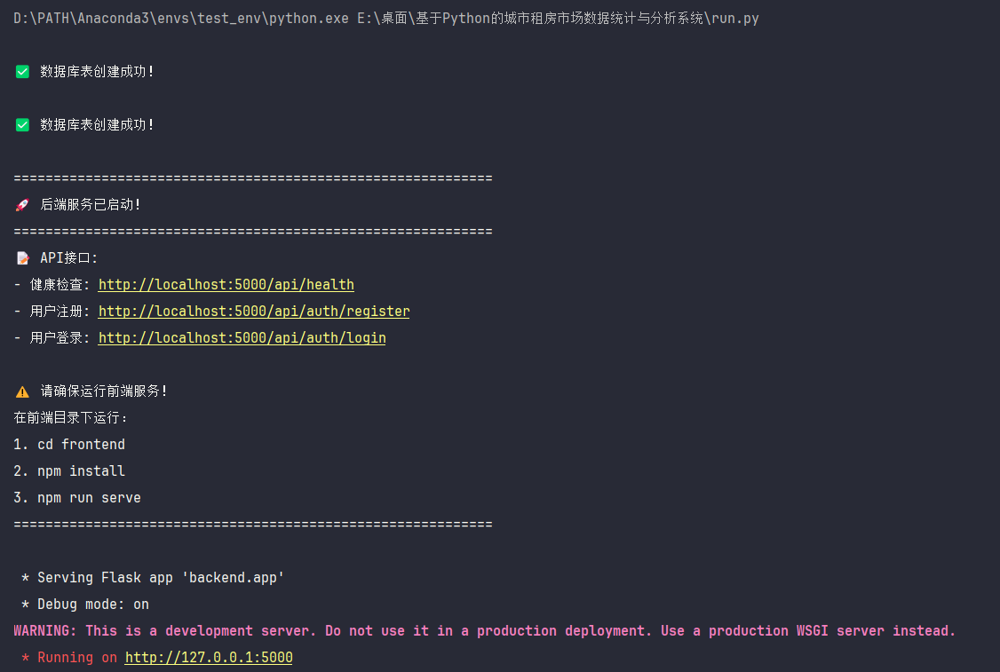

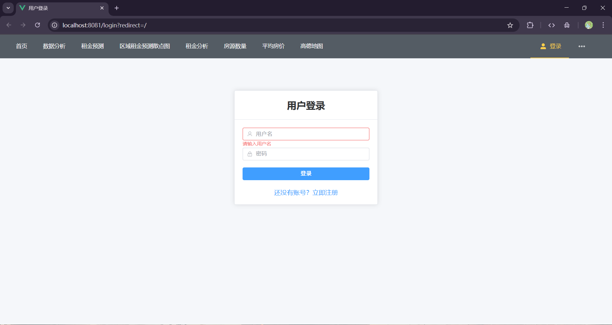

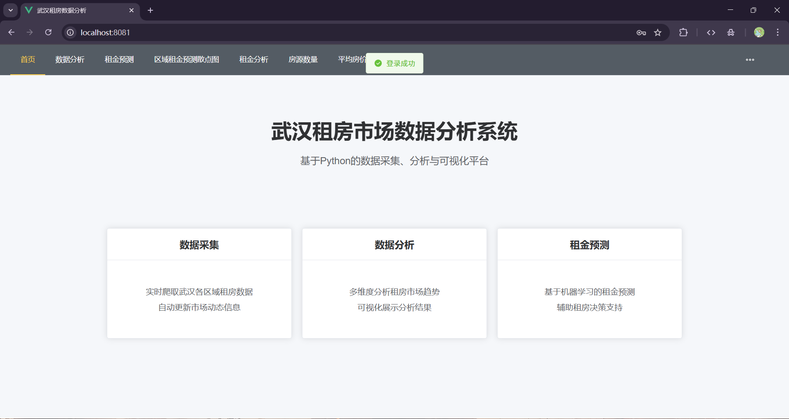

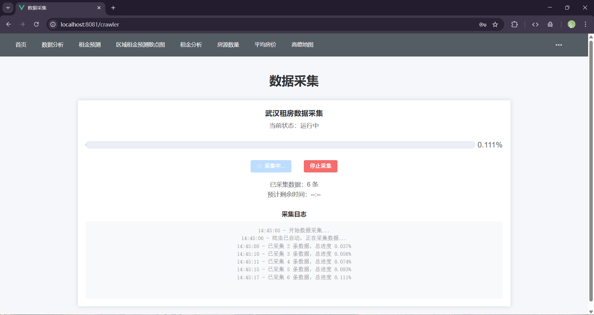

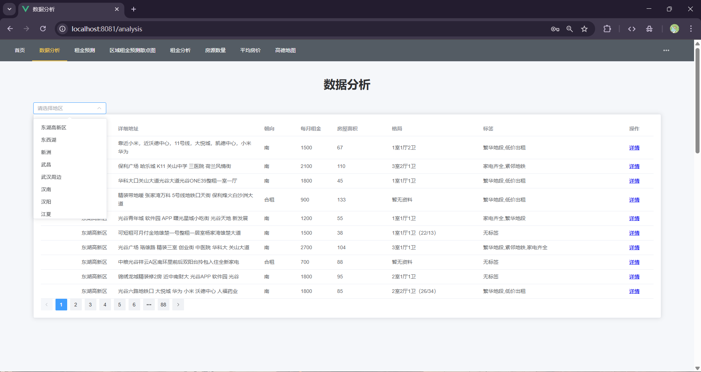

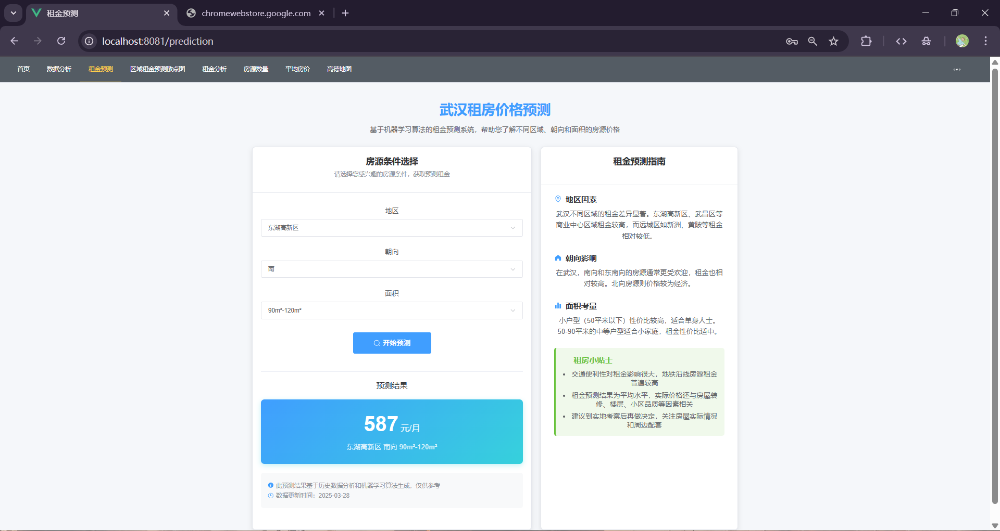

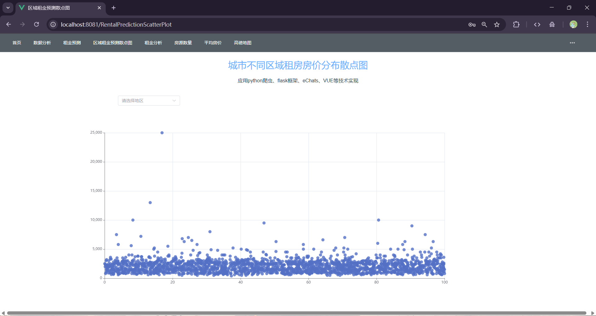

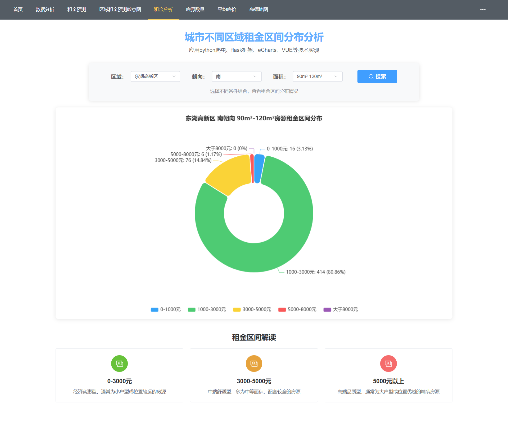

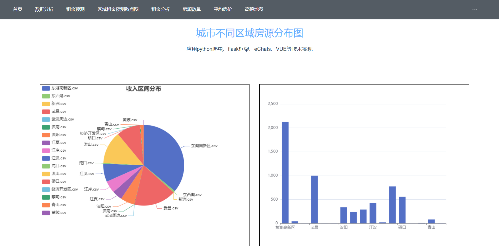

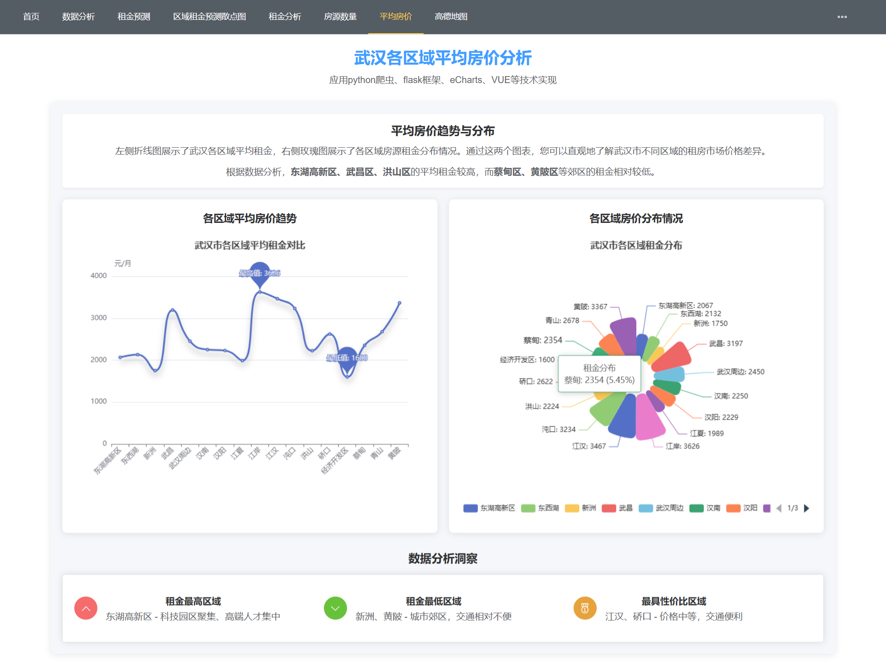

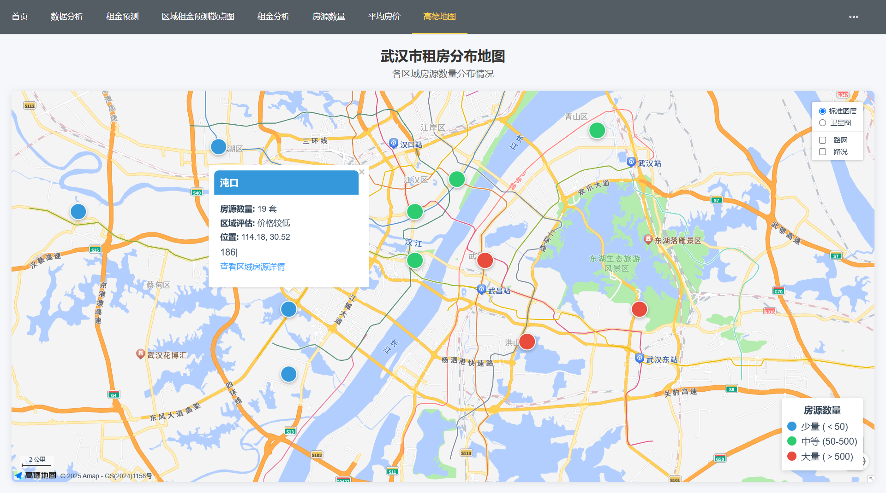

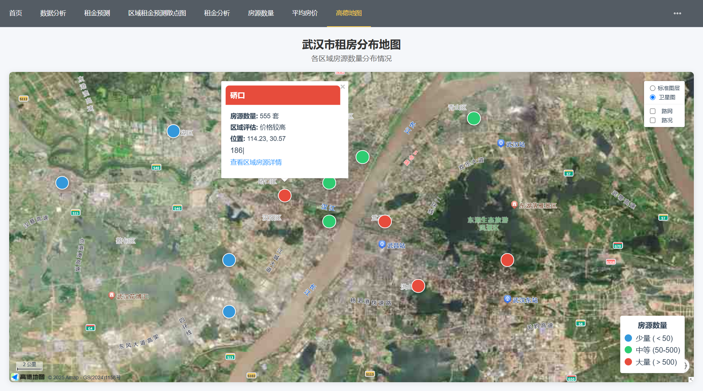